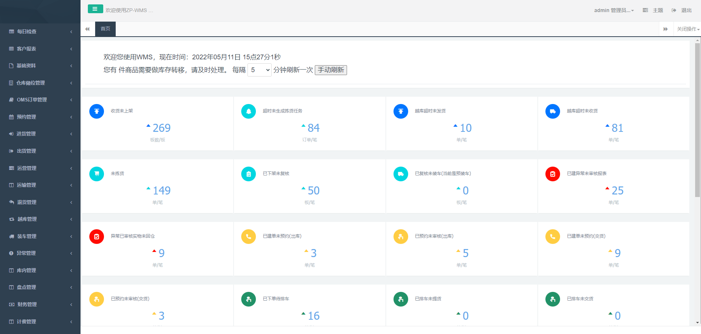
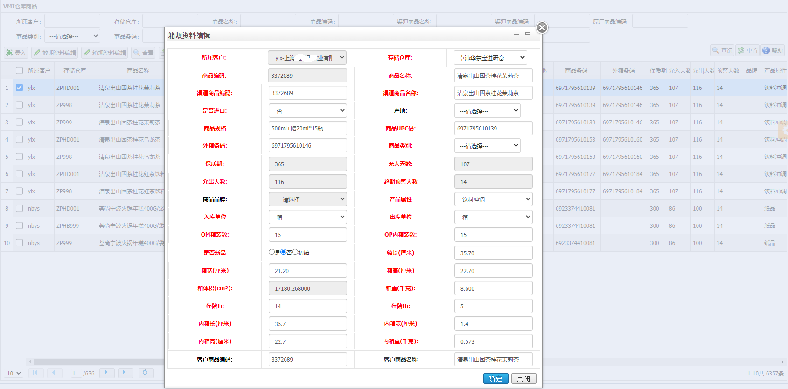

<h2 align="center" style="margin: 30px 0 30px; font-weight: bold;">y-owtb v0.1</h2>
<h2 align="center">基于java开发的订单、仓库、运输、装卸、账单管理系统</h2>

> 该项目包含订单管理、仓库管理、运输配送管理、装卸管理、快递面单管理以及物流费用管理等功能，为您解决多货主、多品牌、多渠道、线上线下订单一体化、2B2C一盘货等难题，助力您实现供应链物流数字化管理。
>
> 目前该项目已部署到10+个仓库，系统日均处理：1000+个SKU、收发货20000+箱、仓库面积10万+平、库存400万+箱、库存准确率99.97%+、日均运输提交货200+趟次、配送200+仓库和便利店、发出快递包裹200000+个。

> QQ交流群：**798979486** 有任何问题可以加群交流，本团队提供支持和服务。
>
> 该项目还在完善中，本团队会持续更新并逐步开源，欢迎大家STAR。

> 测试系统地址 http://112.74.56.180:8882/zpro/ 用户名：admin 密码：123456 

> 有三方物流业务的朋友，**我们免费提供本系统和IT服务**，物流业务可以联系[卓沛物流](http://www.zpro56.com)，卓沛物流将为您提供全平台、全渠道的供应链仓配服务。

#### 1、y-owtb介绍

 ##### 1.1、简介

​	y-oms-wms-tms-bms简称y-owtb，将OMS、WMS、TMS、BMS的核心功能整合在一起，**致力于为中小型企业提供便宜、好用的供应链物流配送管理系统。**

系统主要功能如下：

- OMS**线上线下的销售订单一起管理**

  - 线下订单支持**总仓、门店、前置仓、团点**订单管理，支持客户上门自提；
  - 支持2B订单预约管理
  - 支持2B订单回单管理及异常管理
  - 线上订单按快递配送，已对接**中通、顺丰、邮政**等主流快递公司，已对接**旺店通、SAP、用友U8**等ERP系统，已对接**奇门接口**平台；
  - 支持点对点运输订单管理
  - 支持装卸任务订单管理

- WMS**多货主、多渠道、多仓库一起管理，支持货主自主下单**

  - 按货主管理商品、订单和销售渠道；
  - 按品牌管理商品
  - 可管理进口商品（按到效期操作管理）
  - 支持一仓多货主、一货主多仓；
  - 支持按仓库隔离数据

- WMS单据作业和仓库无纸化作业，

  - **同时支持单据和Android PDA**的全流程作业
    - 收货
    - 上架
    - **拣货（支持按单拣货、波次拣货、按线路合并拣货）**
    - 移库
    - 库存批次调整
    - 分播
    - 复核
    - 装车

- WMS**仓库商品批次、效期精准管理**

  - 所有库存管理到生产日期、到期日期、批次号等信息；
  - **自动效期预警及管制**
  - 可手工冻结问题库存，可按客户要求指定批次出货

- WMS**退货后整操作**，

  - 良品、不良品、破损品、待报废品重新加工装箱
  - 后整商品二次销售出库，打通残次品下水道销售通路

- TMS**司机微信端**，支持司机通过微信公众号操作**提货、交货、回单登记、异常登记**

- TMS**装卸工微信端**

  - 支持装卸工任务分配和登记
  - 从电脑web端可以快速汇总装卸工的数据信息

- BMS**物流账单数据自动计算**

  - 客户合同资料管理
  - 客户物流报价管理
  - 物流单据操作完成后自动计算客户账单

  

##### 1.2、y-owtb系统功能模块：

##### 1.3、可视化管理报表样例

##### 1.4、自定义报表样例

如果您有开发能力，可以自定义出复杂的管理报表

 

特别鸣谢：[jeecg](https://gitee.com/jeecg/jeecg), jeewms

#### 2、软件架构

##### 2.1、系统功能架构概览

##### 2.2、系统技术架构图

待完善

##### 2.3、系统功能简介

###### 2.3.1、门店配送出库通知单

###### 2.3.2、提货交仓通知单

###### 2.3.3、商品资料

###### 2.3.4、收货

###### 2.3.5、批量拣货

###### 2.3.6、盘点

###### 2.3.6、效期预警

###### 2.3.7、司机微信公众号H5提货交货登记

2.3.9、RF端功能

#### 3、安装教程

1.  xxxx
2.  xxxx
3.  xxxx

#### 4、使用说明

1.  xxxx
2.  xxxx
3.  xxxx

#### 5、参与贡献

1.  Fork 本仓库
2.  新建 Feat_xxx 分支
3.  提交代码
4.  新建 Pull Request

#### 特技

1.  使用 Readme\_XXX.md 来支持不同的语言，例如 Readme\_en.md, Readme\_zh.md
2.  Gitee 官方博客 [blog.gitee.com](https://blog.gitee.com)
3.  你可以 [https://gitee.com/explore](https://gitee.com/explore) 这个地址来了解 Gitee 上的优秀开源项目
4.  [GVP](https://gitee.com/gvp) 全称是 Gitee 最有价值开源项目，是综合评定出的优秀开源项目
5.  Gitee 官方提供的使用手册 [https://gitee.com/help](https://gitee.com/help)
6.  Gitee 封面人物是一档用来展示 Gitee 会员风采的栏目 [https://gitee.com/gitee-stars/](https://gitee.com/gitee-stars/)
