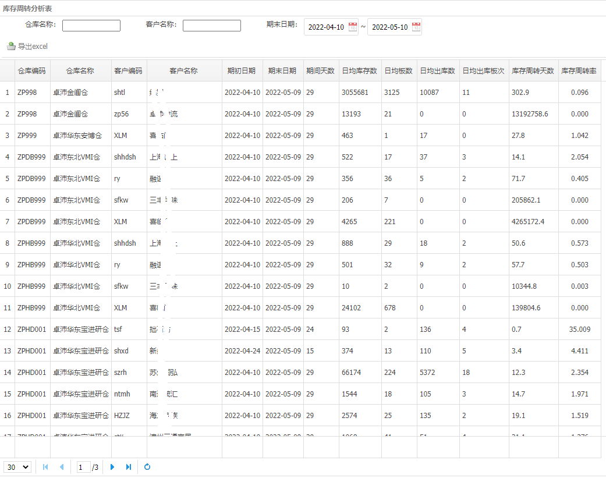
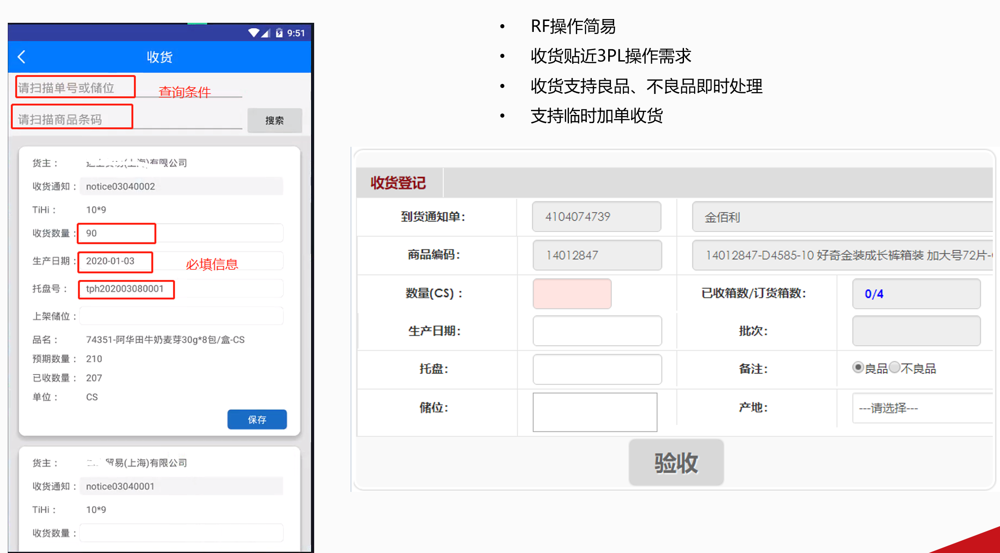
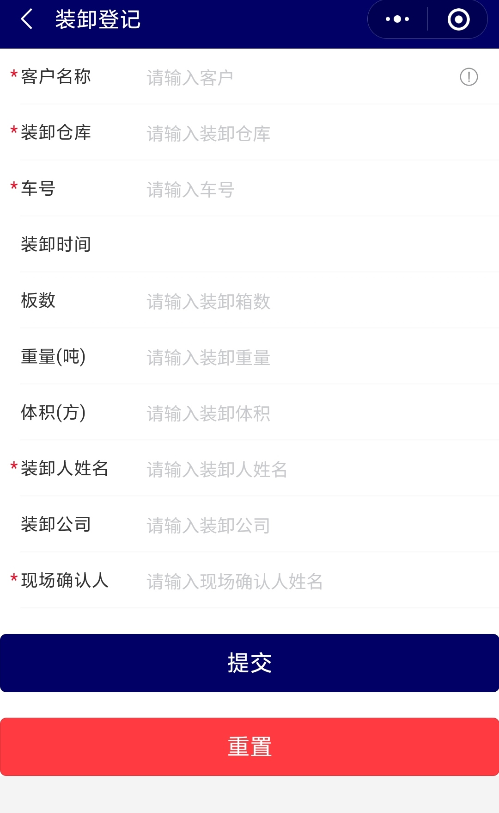

<h1 align="center" style="margin: 30px 0 30px; font-weight: bold;">y-owtb v1.0</h1>
<h1 align="center">基于java开发的订单、仓库、运输、装卸、账单管理系统</h1>

> 该项目包含支持干线运输管理、零担物流管理、中转仓管理、门店配送管理、VMI仓库管理、电商仓库管理、退货管理、后整管理、装卸管理、物流费用管理等系统功能，满足业务端对于多仓库、多货主、多品牌、多渠道、线上线下订单一体化、2B2C库存共享、多承运商、多平台车辆(运满满货拉拉福佑卡车等)、库存效期批次、快递面单对接、退货处理、后整重新包装二次销售等操作的要求，助力您实现供应链物流数字化管理。
>
> 目前该项目已部署到10+个仓库，服务于200+客户，系统日均处理：1000+SKU、收发货30000+箱、仓库面积10万+平、库存400万+箱、库存准确率99.98%+、日均运输提交货200+趟次、配送200+仓库和便利店、发出快递包裹2000+个。

> 咨询请加微信：[Wu_caibao](https://gitee.com/wucaibao/y-oms-wms-tms-bms/raw/master/img/wechat.jpg)，我们提供业务流程讲解、服务器资源和IT技术支持服务，也可以加QQ交流群：[**798979486**](https://gitee.com/wucaibao/y-oms-wms-tms-bms/raw/master/img/OWTB技术群10群聊二维码.png)，本团队会持续更新并逐步开源。
>

> <b>测试系统地址</b>： http://112.74.56.180:8882/zpro/ 用户名：admin 密码：123456
>
> 安卓端安装：[直接下载release.apk包到电脑](https://gitee.com/wucaibao/y-oms-wms-tms-bms/raw/master/download/app-release.apk)，或者[使用二维码下载release.apk包到移动设备](https://gitee.com/wucaibao/y-oms-wms-tms-bms/raw/master/img/releaseapk.png)，安卓端用户名：admin 密码：123456，安卓端登录页面请设置服务器地址为：http://112.74.56.180:8882/zpro  
>
> [gitee地址](https://gitee.com/wucaibao/y-oms-wms-tms-bms)： https://gitee.com/wucaibao/y-oms-wms-tms-bms 
>
> [github地址](https://github.com/wucaibao/y-oms-wms-tms-bms)： https://github.com/wucaibao/y-oms-wms-tms-bms

## 一、简介

<font size="4"><b>y-oms-wms-tms-bms</b>简称:y-owtb，将OMS<strong>(订单管理系统)</strong>、WMS<b>(仓库管理系统)</b>、TMS<b>(运输管理系统)</b>、BMS<b>(财务管理系统)</b>的核心功能整合在一起，**致力于为中小型企业提供稳定、准确、好用、便宜的供应链物流配送管理系统。**</font>


### 1.1 系统主要功能如下：

- OMS**线上线下的销售订单一起管理**

  ```markdown
  - 线下订单支持 总仓、门店、前置仓、团点 订单管理，支持客户上门自提；
  - 支持B2B订单预约管理
  - 支持B2B订单回单管理及异常管理
  - 线上B2C快递订单配送，已对接【中通】、【顺丰】、【邮政】等主流快递公司，已对接【旺店通、SAP、用友U8】等ERP系统，已对接【奇门接口】、【快递鸟】平台；
  - 支持点对点运输订单管理
  - 支持装卸任务订单管理
  ```

- WMS**多货主、多渠道、多仓库一起管理，支持货主自主下单**

  ```markdown
  - 按货主管理商品、订单和销售渠道；
  - 按品牌管理商品
  - 可管理进口商品（按到效期操作管理）
  - 支持一仓多货主、一货主多仓；
  - 支持按仓库隔离数据
  ```

- WMS单据作业和仓库无纸化作业，同时支持单据和**Android PDA**的全流程作业

  ```markdown
  - 收货、上架、拣货（支持【按单拣货】、【波次拣货】、【按线路合并拣货】）、移库、库存批次调整、分播、复核、装车
  ```

- WMS**仓库商品批次、效期精准管理**

  ```markdown
  - 所有库存管理到生产日期、到期日期、批次号等信息；
  - 【自动效期预警及管制】
  - 可手工冻结问题库存，可按客户要求指定批次出货
  ```

- WMS**退货后整操作**

  ```markdown
  - 良品、不良品、破损品、待报废品重新加工装箱
  - 后整商品二次销售出库，打通残次品下水道销售通路
  ```

- TMS**司机微信端**，支持司机通过微信公众号操作 **提货、交货、回单登记、异常登记**

  ```markdown
  - 自动向司机推送运输通知信息，实时抓取当前运输轨迹
  ```

- TMS**装卸工微信端**

  ```markdown
  - 支持装卸工进行装卸任务认领、交接和登记操作，审核人员只需在微信端对相应的任务进行审核即可，实现无纸化的高效作业。
  - 从电脑web端可以快速汇总装卸工的数据信息
  ```

- BMS**物流账单数据自动计算**

  ```markdown
  - 客户合同资料管理
  - 客户物流报价管理
  - 物流单据操作完成后自动计算客户账单
  ```

- **实时业务数据图表展示**

  ```markdown
  - 首页【任务看板】界面，实时监控当前作业量，如【收货未上架、超时未发货】等任务看板
  - 可给货主开通系统账号，货主可实时登陆系统查看自己数据报表 如【入库、出库、订单预约、库存、回单】等
  ```

  

### 1.2  y-owtb系统功能模块：


### 1.3、可视化管理报表样例


### 1.4、自定义报表样例

如果您有开发能力，可以自定义出复杂的管理报表（**库存周转天数、库存周转率**）：

 


**仓库料位空置率、料位使用率、空间使用率、容积率报表**：


特别鸣谢：[jeecg](https://gitee.com/jeecg/jeecg)，jeewms

## 二、软件架构


### 2.1、系统功能架构概览


### 2.2、系统技术架构图

待完善

### 2.3、系统功能简介

#### 2.3.1、门店配送出库通知单


#### 2.3.2、运输提货交仓通知单

支持点对点运输（含正向、逆向）、越库中转运输、零担暂存运输、装卸管理


#### 2.3.3、VMI商品资料

包含进口信息、品牌、条码、允收天数、允出天数、保质期天数、箱装数、拆零数、码盘TiHi、进出口、材积、重量等关键资料，有效支持精准的效期批次管理


#### 2.3.4、收货

支持生产日期、批次号、到期日期（进口商品一般按到期日期收货）、托盘号、料位、TiHi、收货品质的管理




#### 2.3.5、批量拣货

支持按波次汇单后，按订单拣货、批次拣货免分播、先批后分、边拣边分


#### 2.3.6、盘点

支持循环盘点、动碰盘点、按料位区间盘点、按货主盘点、明盘/盲盘等管理操作要求


#### 2.3.7、效期预警

自动锁定超允出日期的库存，预先提醒允出期异常库存，精准管理到每个料位、每个批次的库存效期状态


#### 2.3.8、司机微信公众号H5提货交货登记

司机通过微信可以接受运单委托，登记提货、报到、交货、回单信息


#### 2.3.9、装卸工微信小程序登记

| 装卸登记微信小程序                                           | 交货异常登记微信小程序                                       |
| ------------------------------------------------------------ | ------------------------------------------------------------ |
|  |  |

#### 2.4.0、安卓RF端功能


## 三、安装教程

1.  xxxx
2.  xxxx
3.  xxxx

## 四、使用说明

1.  xxxx
2.  xxxx
3.  xxxx
4.  有三方物流业务的朋友，**我们免费提供本系统和IT服务**，物流业务可以联系[卓沛物流](http://www.zpro56.com)，卓沛物流将为您提供全平台、全渠道的供应链仓配服务。

## 五、参与贡献

1.  Fork 本仓库
2.  新建 Feat_xxx 分支
3.  提交代码
4.  新建 Pull Request


#### 特技

1.  使用 Readme\_XXX.md 来支持不同的语言，例如 Readme\_en.md, Readme\_zh.md
2.  Gitee 官方博客 [blog.gitee.com](https://blog.gitee.com)
3.  你可以 [https://gitee.com/explore](https://gitee.com/explore) 这个地址来了解 Gitee 上的优秀开源项目
4.  [GVP](https://gitee.com/gvp) 全称是 Gitee 最有价值开源项目，是综合评定出的优秀开源项目
5.  Gitee 官方提供的使用手册 [https://gitee.com/help](https://gitee.com/help)
6.  Gitee 封面人物是一档用来展示 Gitee 会员风采的栏目 [https://gitee.com/gitee-stars/](https://gitee.com/gitee-stars/)
